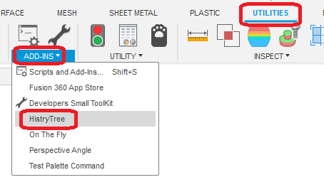
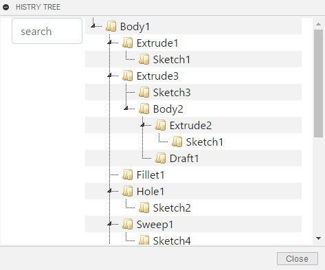

# ***Fusion360_HISTORY-TREE***
Displays the history in a tree centered on the body.
Currently, this add-in is under development and incomplete.

## **Installation**:

To install, download/extract the zip file and register the "HistryTree" folder as an **add-in**.

To register add-ins, follow the instructions [here](https://knowledge.autodesk.com/support/fusion-360/troubleshooting/caas/sfdcarticles/sfdcarticles/How-to-install-an-ADD-IN-and-Script-in-Fusion-360.html).

---

## **Usage**:

After launching the add-in, the "HistryTree" command will be added in "Utilities" - "ADD-INS".

By clicking on it, a dialog will appear.

---

## **Action** :

The following environment is confirmed.

- Fusion360 Ver2.0.15509
- Windows10 64bit Pro , Home

---

## **License**:
- Apache License 2.0